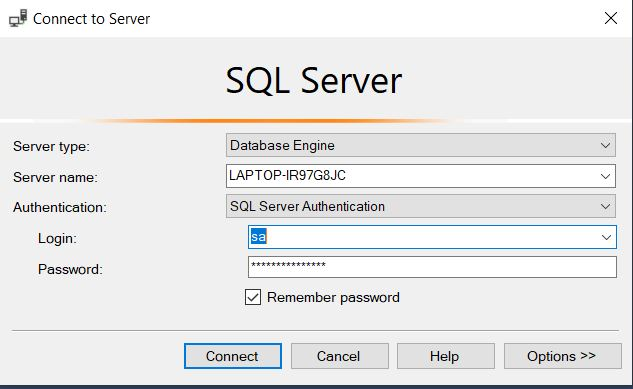

# Giới thiệu dự án Alo_Tra

<div style="text-align: justify;">
Đề tài "Xây dựng website chuỗi bán trà sữa AloTra" hướng đếnviệcphát triển một nền tảng trực tuyến toàn diện nhằm hỗ trợ và nâng cao hiệu quả hoạt động kinh doanh của chuỗi cửa hàng trà sữa AloTra.

Trong bối cảnh thị trường trà sữa cạnh tranh khốc liệt và xu hướng chuyển đổi số ngày cànggiatăng, việc xây dựng một website chuyên nghiệp là yếu tố quan trọng để nângcao thương hiệu, mở rộng tệp khách hàng và tối ưu hóa các quy trình kinhdoanh.

Website AloTra được thiết kế không chỉ để cung cấp thông tin chi tiết vềsản phẩm, menu đa dạng với các loại trà sữa, topping, và khuyến mãi, mà còntích hợp nhiều chức năng hiện đại như: đặt hàng trực tuyến, theo dõi đơnhàng, thanh toán điện tử qua các cổng thanh toán phổ biến, và quản lý tài khoảnngười dùng. Một tính năng nổi bật khác là định vị cửa hàng, cho phép người dùng dễ dàng tìm kiếm chi nhánh gần nhất cùng với thông tin chi tiết như địa chỉ, giờmở cửa, và số lượng sản phẩm có sẵn.

Bên cạnh đó, website sẽ được xây dựngvới giao diện thân thiện, hiện đại, tối ưu trên cả máy tính và thiết bị di động, đảm bảo mang lại trải nghiệm mượt mà cho người dùng. Đề tài này không chỉ có ý nghĩa trong việc giải quyết các thách thức thực tiễn mà chuỗi trà sữa AloTra đang gặp phải, mà còn thể hiện sự sáng tạo và ứngdụng công nghệ trong lĩnh vực bán lẻ thực phẩm và đồ uống.

Với mục tiêu cuối cùng là xây dựng một hệ thống vận hành hiệu quả, gia tăng sự hài lòng của khách hàng và mở rộng quy mô kinh doanh, dự án này hứa hẹn mang lại giá trị lâu dài và tiềm năng phát triển bền vững cho thương hiệu AloTra.

</div>

# Công nghệ sử dụng

**1. Frontend**

- Sử dụng html, css và javascript. Ngoài ra, còn sử dụng thư viện Bootstrap.

**2. Backend**

- Sử dụng Spring Boot.

**3. Database**

- Hệ cơ sở dữ liệu quan hệ: Microsoft SQL Server
- Framework JPA, ORM Hibernate.

**4. Mô hình**

- Model - View - Controller (MVC).

# Những điểm lưu ý khi chạy dự án Alo_Tra

**1. Phiên bản JDK**

- Chạy trên JDK 22 trở lên.

**2. Cơ sở dữ liệu**

- Tạo database Alo_Tra trước khi chạy dự án.

- Chuỗi kết nối: Trong file application.properties cần thay đổi những thành phần trong chuỗi kết nối đúng với máy tính của bạn.

```bash
spring.datasource.url=jdbc:sqlserver://${SERVER_NAME}:1433;database=Alo_Tra;encrypt=false;trustServerCertificate=true;sslProtocol=TLSv1.2;characterEncoding=UTF-8
```

> 💡 **Lưu ý:** ${SERVER_NAME} là tên server của database. Tên database là Alo_Tra.  
> 
> Ví dụ ở đây SERVER_NAME là LAPTOP-IR97GBJC

- Mật khẩu database: Trong file application.properties cần thay đổi mật khẩu.

```bash
spring.datasource.password=123456
```

**3. Cấu hình mail**

- Thay đổi tài khoản mail

```bash
spring.mail.username
```

- Thay đổi mật khẩu ứng dụng mail

```bash
spring.mail.username
```

**4. Tài khoản demo**

- Quyền Admin:
  - Tài khoản: Admin
  - Mật khẩu: 123
- Quyền Manager:
  - Tài khoản: seller1
  - Mật khẩu: 123
- Quyền User:
  - Tài khoản: user1
  - Mật khẩu: 123

**5. Cài đặt lombok**

- Nếu sử dụng spring tool suite thì phải cài lombok

**6. File báo cáo**

- Ở thư mục FileBaoCao

**6. File database**

- Ở thư mục FileDatbase
